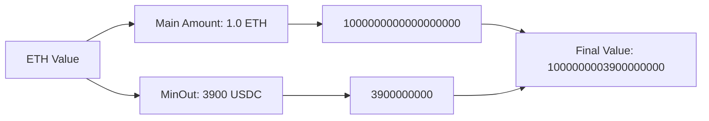

# [ztx](https://github.com/z0r0z/ztx)    

Zero TX (ZTX) is a gas optimization technique that enables lightweight programmability in smart contract interactions through the least significant bits of ETH transfers, eliminating the need for calldata.

## Concept

ZTX encodes additional parameters directly in the value field of ETH transfers. For example, when swapping ETH for USDC, the minimum output amount for slippage protection against an AMM is encoded in the last 10 digits of the transfer value:

## Getting Started

Run: `curl -L https://foundry.paradigm.xyz | bash && source ~/.bashrc && foundryup`

Build the foundry project with `forge build`. Run tests with `forge test`. Measure gas with `forge snapshot`. Format with `forge fmt`.
